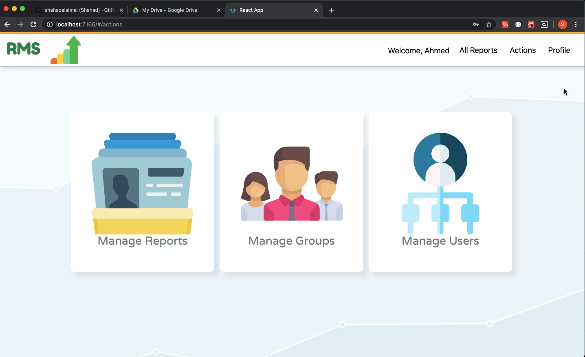
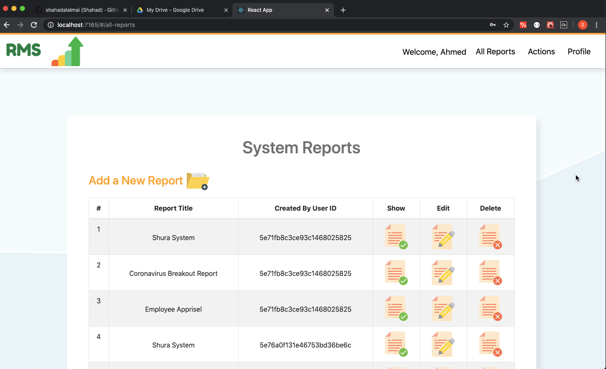
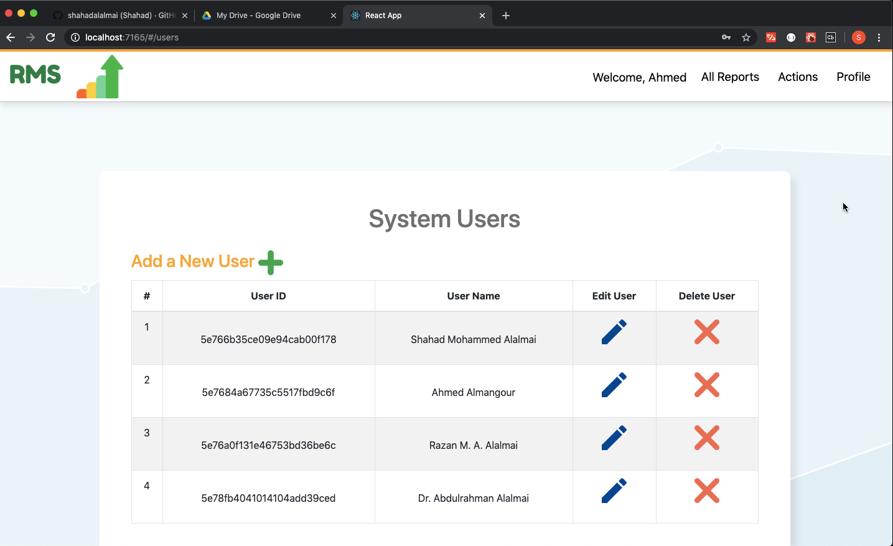

# Report Management System

## About

RMS is a system for managing reports in any organization.
The system allows you to have different roles of users and different functionalities according to their roles.
An admin user will be able to manage all system reports, groups and users.
However, a regular user will only be able to manage his reports only.

The system includes an authentication capability as well as all the components and routes needed to sign up, sign in, change passwords, edit profile and sign out. All by the use of an API to communicate between both front-end and back-end.

## Technologies Used

1. React for front-end.
1. Express for back-end.
1. MongoDB for database.
1. Axios for Ajax API.

## System Screenshots:

#### Landing Page:

#### Regular User Reports:

#### User Profile:

#### Admin User Landing Page:

#### Manage System Reports:

#### Manage System Groups:

#### Manage System Users:

#### Sign-Up a User:

## [License](LICENSE)

1. Some of the software code is licensed under GNU GPLv3. For commercial use or
    alternative licensing, please contact legal@ga.co.
